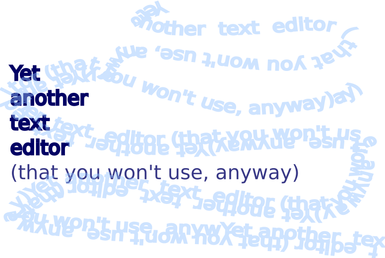

# Yet Another Text Editor 

Simple text editor that saves in your browser temp files.

## How to use it?

Just type text and press 'save' for saving it. You can load previous session by pressing 'load' button

